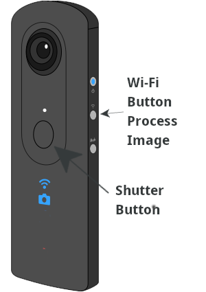
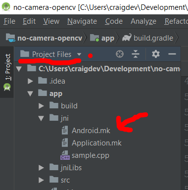
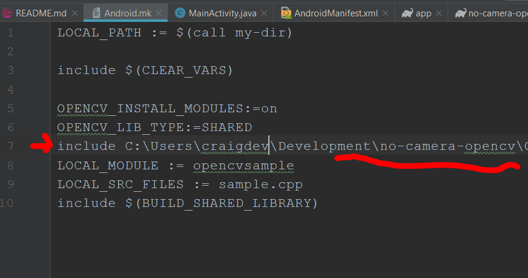
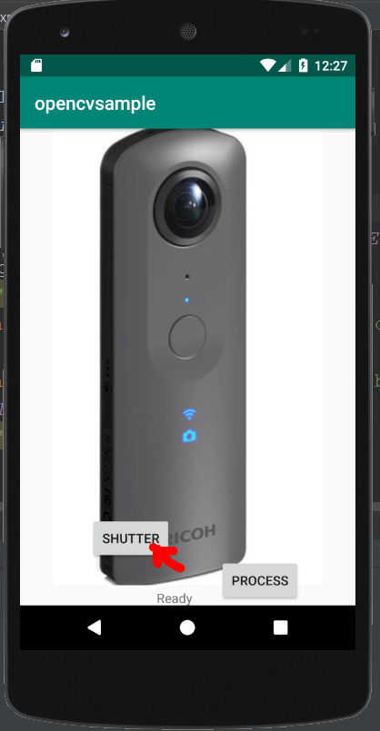
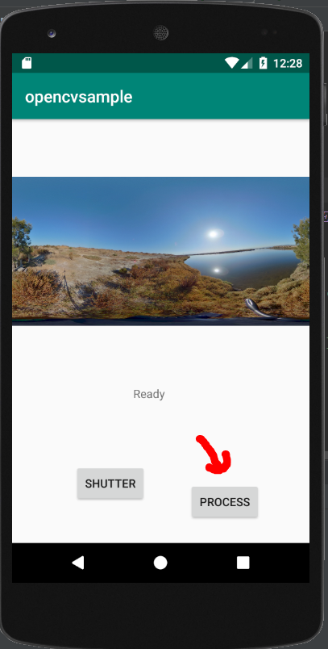
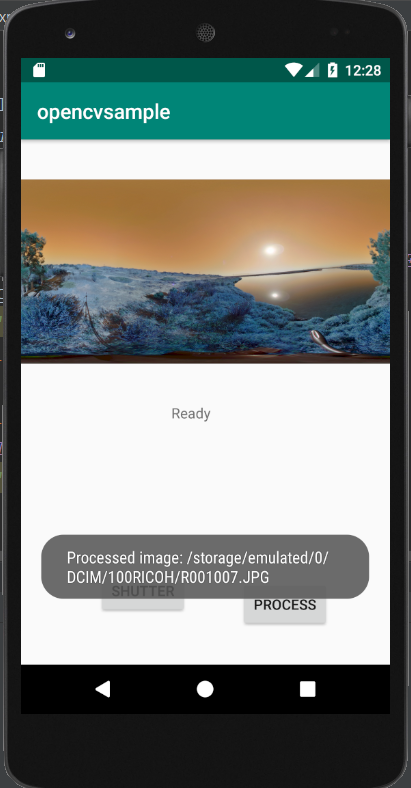
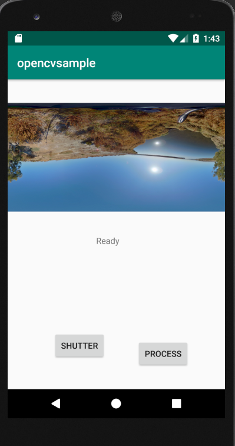

# No-Camera OpenCV
Sample application that shows OpenCV running on both a physical 
device RICOH THETA V and an Android Virtual Device.  You
can develop a plug-in on the emulator and then have it run
on a physical device camera with only minor modifications.

Based on original work by roohii_3 with
modifications by https://github.com/iamagod (kasper on theta360.guide)

## Important Note on App Permissions

You must enable storage permissions in the settings.
If you have using a physical device RICOH THETA, you can
use Vysor to go into Settings and enable storage permissions.

## Usage in emulator

* Use your mouse to press *Shutter* button. It will load an 
image into `/sdcard/DCIM/100RICOH/`
* Use your mouse to press the *Process* button. It will
display an image processed with OpenCV to the emulator screen.

## Using real camera

* Press the shutter button to take a picture
* After 4 seconds, press the Wi-Fi button to process the picture

You can see the processed image in Vysor. This demo does not
save the processed image to disk.

The [no-camera-template](https://github.com/codetricity/no-camera-template)
 shows how to save the processed file
to disk.

## Build

* JRE 1.8.0
* Android Studio 3.3.2
* Gradle 4.10.1
* OpenCV 3.4.5
* in gradle.build (app) specify `sourceCompatibility` and `targetCompatibility` as 1.8 due to use of lambda

In `Android.mk` set your include path.

To see the `Android.mk` file, go to the 
"Project Files" view of Android Studio.  The
default view is "Android".  You need to access
Project Files from the drop-down menu.

Edit the path in the screenshot below to match the path
of your local OpenCV source code (which is part of this
repo).

## Screenshots

Emulator

### flipped from challenge

## Changes

2019/4/2

* added OpenCV 3.4.5 source to repo
* added directions to edit include path
* fixed problem with screen message for status of permissions
* added library version information to README
* added screenshots to README
* added release folder for the completed apk
